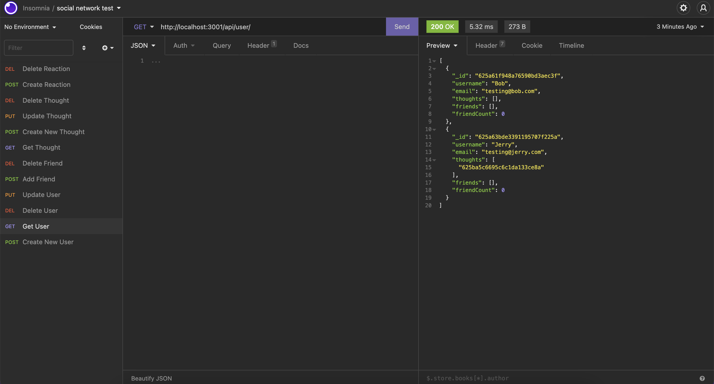

# net-social-work

## Description
I have built this application so that people can share what they're thinking, while also being able to read their friends thoughts and react to them and also make a friends list.
I have used MongoDB and Mongoose to create this API social network.

## Installation

If you want to use this project you will first need to clone it from my github repo. 

Next, you will need to run the "npm install" in the CLI, this will add the necessary dependancies for the project. Once this has been done you need to run "npm start" to start the server.

Be sure to install MongoDB before testing each path in the Insomnia software.

## Usage
Taking a NoSQL database approach in this project. It is made to show the backend of a social network API and how this would work while taking a NoSQL database approach. Users add their thoughts plus they can also add or remove friends. Users can also react to other peoples thoughts. Thoughts can be updated or deleted. 

Here is an image of all the Insomnia route testing routes set up. 

Due to the amount of testing options i'm not going to show you how to do all of them by adding images. However if you would like to see more on how to... Please watch my <a href="">Walk through video</a>